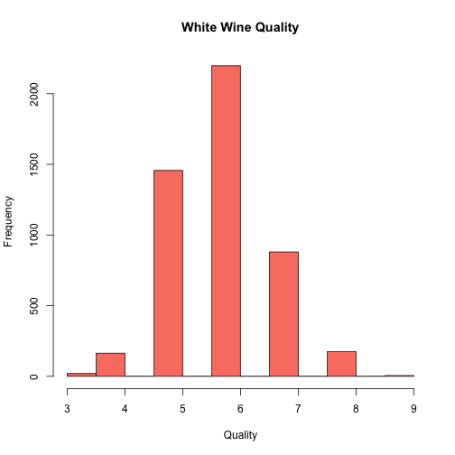

## Introduction

The wine quality datasets used for this presentation were taken from the UCI datasets.

https://archive.ics.uci.edu/ml/datasets/Wine+Quality

The companion article to the datasets proposed a data mining approach to predict the human wine taste preferences.

http://www.sciencedirect.com/science/article/pii/S0167923609001377

--- .class #id

## Datasets description

- Red wine (only 4 rows and 3 predictors are shown)


```
##   volatile.acidity   pH alcohol quality
## 1             0.70 3.51     9.4       5
## 2             0.88 3.20     9.8       5
## 3             0.76 3.26     9.8       5
## 4             0.28 3.16     9.8       6
```

- White wine (only 4 rows and 3 predictors are shown)


```
##   volatile.acidity   pH alcohol quality
## 1             0.27 3.00     8.8       6
## 2             0.30 3.30     9.5       6
## 3             0.28 3.26    10.1       6
## 4             0.23 3.19     9.9       6
```


--- .class #id

## Red Wine

 

--- .class #id

## White Wine

 


